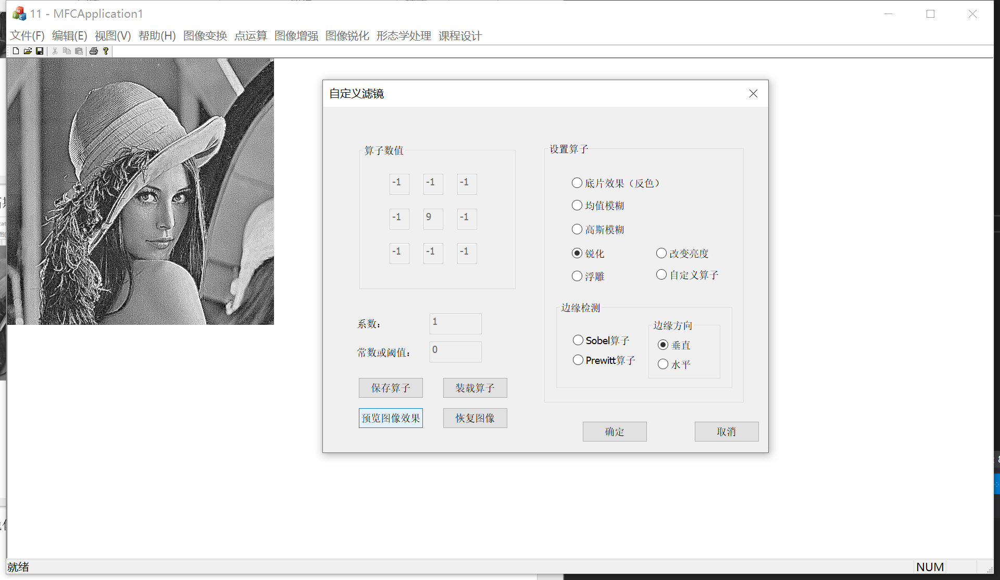
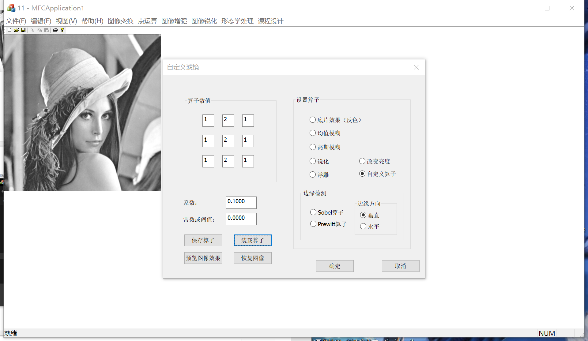

# 一、目录

[一、目录](#一目录)

[二、引言](#二引言)

[三、绪论](#三绪论)

[1.任务](#1任务)

[2.目的](#2目的)

[3.基本要求](#3基本要求)

[4.内容](#4内容)

[四、相关原理、方法及技术等介绍](#四相关原理方法及技术等介绍)

[1.灰度的阈值变换](#1灰度的阈值变换)

[1.1 算法1：迭代法](#11-算法1迭代法)

[1.2 算法2：OTSU方法](#12-算法2otsu方法)

[1.3 算法3：最大最小熵法](#13-算法3最大最小熵法)

[1.4 算法4：自适应阈值分割](#14-算法4自适应阈值分割)

[2.灰度的窗口变换](#2灰度的窗口变换)

[3.灰度拉伸](#3灰度拉伸)

[4.图像的直方图均衡化](#4图像的直方图均衡化)

[5.滤镜（模板操作）](#5滤镜模板操作)

[5.1反色变换（底片效果）& 改变亮度](#51反色变换底片效果-改变亮度)

[5.2平滑/模糊（均值模糊，高斯模糊）](#52平滑模糊均值模糊高斯模糊)

[5.3 锐化（拉普拉斯）](#53-锐化拉普拉斯)

[5.4 边缘检测](#54-边缘检测)

[5.5 浮雕效果](#55-浮雕效果)

[6.图像的几何变换](#6图像的几何变换)

[6.1平移](#61平移)

[6.2 镜像](#62-镜像)

[6.3 转置](#63-转置)

[6.4 缩放](#64-缩放)

[6.5 旋转](#65-旋转)

[7.图像风格化](#7图像风格化)

[8.应用](#8应用)

[8.1 图像预处理](#81-图像预处理)

[8.2 阈值分割](#82-阈值分割)

[8.3 形态学处理](#83-形态学处理)

[五、算法效果展示](#五算法效果展示)

[5.1 灰度的阈值变换](#51-灰度的阈值变换)

[5.1.1 通过拖动右边的线性图和输入阈值改变阈值](#511-通过拖动右边的线性图和输入阈值改变阈值)

[5.1.2 迭代法计算阈值](#512-迭代法计算阈值)

[5.1.3 OTSU法](#513-otsu法)

[5.1.4 最大熵法](#514-最大熵法)

[5.1.5 自适应阈值法](#515-自适应阈值法)

[5.2 灰度的窗口变换](#52-灰度的窗口变换)

[5.3 灰度拉伸](#53-灰度拉伸)

[5.4 图像的直方图均衡化](#54-图像的直方图均衡化)

[5.5 滤镜(模板操作)](#55-滤镜模板操作)

[5.5.1 反色效果](#551-反色效果)

[5.5.2 均值模糊](#552-均值模糊)

[5.5.3 高斯模糊](#553-高斯模糊)

[5.5.4 锐化](#554-锐化)

[5.5.5 浮雕](#555-浮雕)

[5.5.6 改变亮度](#556-改变亮度)

[5.5.7 自定义算子](#557-自定义算子)

[5.5.8 边缘检测](#558-边缘检测)

[5.6 图像的几何变换：平移、旋转等](#56-图像的几何变换平移旋转等)

[5.6.1 平移变换](#561-平移变换)

[5.6.2 镜像变换](#562-镜像变换)

[5.6.3 缩放变换](#563-缩放变换)

[5.6.4 旋转变换](#564-旋转变换)

[5.6.5 转置变换](#565-转置变换)

[5.7 图像风格化](#57-图像风格化)

[5.7.1 素描](#571-素描)

[5.7.2 复古](#572-复古)

[5.7.3 像素风](#573-像素风)

[5.7.4 浮雕风](#574-浮雕风)

[5.8 应用](#58-应用)

[测试图像1](#测试图像1)

[测试图像2](#测试图像2)

[测试图像3](#测试图像3)

[5.9 选做](#59-选做)

[Canny 算子进行边缘检测](#canny-算子进行边缘检测)

[USM锐化](#usm锐化)

[六、结论](#六结论)

[6.1 灰度阈值变换方法的对比](#61-灰度阈值变换方法的对比)

[6.2 直方图均衡化](#62-直方图均衡化)

[6.3 应用（MATLAB验证）](#63-应用matlab验证)

[七、参考文献](#七参考文献)

# 二、引言

数字图像处理技术起源于20世纪20年代，经过半个多世纪的发展，目前已经广泛

地应用于工业、医疗保健、航空航天、军事等各个领域，在国民经济中发挥着越来越大

的作用。目前，随着信息高速公路、数字化地球概念的提出以及因特网的飞速发展，数

字图像以其信息量大、传输速度快、作用距离远等- -系列优点必将成为人类获取信息的

重要来源。因此，数字图像处理科学与技术逐步向其他学科领域渗透，并为其他学科所

利用是科学发展的必然。

Microsoft公司开发的Visual C++一直是一种具有高度综合性能的软件开发工具，用

它开发出的程序有着运行速度快、可移植能力强等优点。因此，在对数字图像进行处理

时通常是采用Visual C++ 进行编程。本书中所有的示例程序都是采用该开发工具来完成

的。

# 三、绪论

## **1.任务**

数字图像处理是指用计算机处理图像的技术。《图像处理课程设计》是专业教学中的一个重要的实践性环节。本课程设计的目的是帮助学生巩固和加强已学《数字图像处理》理论知识，并能使学生综合运用所学的理论知识，进行较为复杂的图像处理工作，以此来培养学生理论联系实际、分析和解决技术问题的能力，为以后从事专业技术工作打下必要的基础。

## **2.目的**

综合运用C++语言（其他语言也可以）实现图像处理的程序设计。

## **3.基本要求**

（1）掌握数字图像处理的基本原理。

（2）熟悉图像处理的基本方法

（3）可以处理8位图像也处理24位图像。以8位图像为主。

（4）自己设计界面。在课程实验的框架下（使用其他语言可以不采用课程框架）。

## **4.内容**

1、灰度的阈值变换。 （二值化，图像分割）

2、灰度的窗口变换。

3、灰度拉伸。

4、图像的直方图均衡化。

5、滤镜（模板操作）。

1.  图像的几何变换：平移、旋转等。
2.  实现图像的多种风格化。
3.  应用。

9、选作。

1）实现 Canny 算子进行边缘检测。

2）实现USM锐化。

3）给图像添加不可见数字水印。可以添加，也可以测试出来，具有一定的鲁棒性。

# 四、相关原理、方法及技术等介绍

## 1.灰度的阈值变换

灰度的阈值变换可以将--幅灰度图像转换成黑白.值图像。它的操作过程是先让用户指定一个阈值，如果图像中某像素的灰度值小于该阈值，则将该像素的灰度值设置为0，否则

灰度值设置为255。

灰度阈值变换的变换函数表达式如下:

T为阈值。

### 1.1 算法1：迭代法

图像分割后的两部分A和B的均值和基本保持稳定。也就是说，随着迭代的进行，取 [mean(A)+mean(B)]/2 最终的收敛值作为分割阈值。其具体方法如下：

1）选取一个初始估计值T；

2）用T分割图像。这样便会生成两组像素集合：G1由所有灰度值大于T的像素组成，而G2由所有灰度值小于或等于T的像素组成。

3）对G1和G2中所有像素计算平均灰度值u1和u2。

4）计算新的阈值：T= (u1 + u2)/2。

重复步骤（2）到（4），直到得到的T值之差小于一个事先定义的参数T0。

### 1.2 算法2：OTSU方法

在图像处理中Otsu方法，是以 Nobuyuki otsu 的名字命名的（日本人，大津展之），常用于基于图像分割的聚类。该算法的理论依据是：假定图像包含两类像素（前景像素和背景像素），直方图为双峰直方图，然后计算使得两类像素能分开的最佳阈值（类内方差），或等价的间类间方差最大。

对于图像 I(x,y)，前景(即目标)和背景的分割阈值记作 T，属于前景的像素点数占整幅图像的比例记为 ω0，平均灰度为 μ0；背景像素点数占整幅图像的比例为 ω1，平均灰度为 μ1；整幅图像的平均灰度记为μ，类间方差记为g。

假设图像大小为M×N，图像中像素的灰度值小于阈值 T 的像素个数为 N0，像素灰度大于阈值T的像素个数为 N1，那么：

ω0=N0/ M×N (1)

ω1=N1/ M×N (2)

N0+N1=M×N (3)

ω0+ω1=1 (4)

μ=ω0\*μ0+ω1\*μ1 (5)

g=ω0(μ0-μ)\^2+ω1(μ1-μ)\^2 (6)

g=ω0ω1(μ0-μ1)\^2 (7)

采用遍历的方法使得类间方差g最大的阈值T，即为所求。Ostu方法可以形象地理解为：求取直方图有两个峰值的图像中那两个峰值之间的低谷值T。

### 1.3 算法3：最大最小熵法

信息熵（entropy）的概念来源于信息论，假设信源符号 有 种取值，记为，且每一种信源出现的概率，记为。那么该信源符号的信息熵记为。图像也可以看作一种信源，把信息熵的概念带入图像就是，图像的信息熵越大（信息量大），所包含的细节越多，图像就越清晰。假设输入图像为 I，代表归一化的图像灰度直方图，那么对于 8 位图可以看成由 256 个灰度符号，且每一个符号出现的概率为 组成的信源，其中 0 ≤ k ≤ 255 。

利用熵计算阈值的步骤如下：

1.  计算 I的累加概率直方图，又称零阶累积矩。
2.  计算各个灰度级的熵。

3）计算使最大化的t值，该值即为得到的阈值，即。

### 1.4 算法4：自适应阈值分割

把图像分成若干部分子图像（如2\*2,4部分），对每一个部分求阈值。再按照固定阈值的分割方法进行分割。具体算法步骤如下：

1）对某个像素值，原来为S，取其周围的n×n的区域，求取区域均值或高斯加权值，记为T。

2）对8位图像，如果S\>T，则该像素点二值化为255，否则为0。

优化：

1）在实际操作中，通过均值模糊或高斯模糊实现区域均值或高斯加权值。

2）增加超参数C，当S\>T-C时，将像素值设置为255。

3）设置范围在0-1的超参数a，当S\>(1-a)T时，将像素值设置为255，a通常取0.15。

## 2.灰度的窗口变换

灰度的窗口变换也是一种常见的点运算。它的操作和阈值变换相类似。它限定一个窗口

范围，该窗口中的灰度值保持不变;小于该窗口下限的灰度值直接设置为0;大于该窗口上

限的灰度值直接设置为255。

灰度窗口变换的变换函数表达式如下:

式中L表示窗口的下限，U表示窗口的上限。

灰度窗口变换非常实用。例如:一幅图像图像的背景是浅色，图像上的物体是深色，则直方图上的第一个峰值表示物体，第二个峰值表示背景。设双峰之,间的谷底在T处，当该图像进行窗口变换时，窗口.上限取值为T，下限为0, 变换后的结果将有效的消除图像的背景。

## 3.灰度拉伸

灰度拉伸和灰度的线性变换有点类似，都用到了灰度的线性变换。但不同之处在于灰度拉伸不是完全的线性变换，而是分段进行线性变换。它的灰度变换函数如图所示，函数表达式如下：

式中(, )和(, )是图中的两个转折点的坐标。

灰度拉伸可以更加灵活的控制输出灰度直方图的分布，它可以有选择的拉伸某段灰度区间以改善输出图像。图3-18所示的变换函数的运算结果是将原图在和之间的灰度拉伸到和之间。如果一幅图像灰度集中在较暗的区域而导致图像偏暗，可以用灰度拉伸功能来拉伸(斜率\>1)物体灰度区间以改善图像;同样如果图像灰度集中在较亮的区域而导致图像偏亮，也可以用灰度拉伸功能来压缩(斜率\<1)物体灰度区间以改善图像质量。

## 4.图像的直方图均衡化

灰度均衡有时也称直方图均衡，目的是通过点运算使输入图像转换为在每一灰度级上都有相同的像素点数的输出图像(即输出的直方图是平的)。这对于在进行图像比较或分割之前将图像转化为一致的格式是十分有益的。

按照图像的概率密度函数(PDF, 归一化到单位面积的真方图)的定义:

其中为真方图，为图像的面积。

设转换前图像的概率密度函数为 ,转换后图像的概率密度函数为，转换函数为。 由概率论知识，我们可以得到:

=

这样，如果想使转换后图像的概率密度所数为1 (即直方图为平的)，则必须满足:

等式两边对r积分，可得:

该转换公式被称为图像的累积分布函数(CDF)。

上面的公式是被归一化后推导出的,对于没有归一化的情况,只要乘以最大灰度值(,对于灰度图就是255)即可。灰度均衡的转换公式为:

对于离散图像，转换公式为:*  
*

式中为第级灰度的像素个数。

## 5.滤镜（模板操作）

### 5.1反色变换（底片效果）& 改变亮度

反色变换和改变亮度都属于灰度的线性变换。

灰度变换方程为：

fA为线性函数的斜率，fB为线性函数的在y轴的截距，DA表示输入图像的灰度，DB表示输出图像的灰度。

反色变换的斜率为-1，截距为0。改变亮度的斜率为1，截距为增加的亮度。

### 5.2平滑/模糊（均值模糊，高斯模糊）

均值滤波也称为线性滤波，其采用的主要方法为邻域平均法。均值滤波是图像处理中最常用的手段，从频率域观点来看均值滤波是一种低通滤波器，高频信号将会去掉，因此可以帮助消除图像尖锐噪声，实现图像平滑，模糊等功能。线性滤波的基本原理是用均值代替原图像中的各个像素值，即对待处理的当前像素点（x，y），选择一个模板，该模板由其近邻的若干像素组成，求模板中所有像素的均值，再把该均值赋予当前像素点（x，y），作为处理后图像在该点上的灰度g（x，y），即g（x，y）=∑f（x，y）/m ，m为该模板中包含当前像素在内的像素总个数。

不足之处：均值滤波本身存在着固有的缺陷，即它不能很好地保护图像细节，在图像去噪的同时也破坏了图像的细节部分，从而使图像变得模糊，不能很好地去除噪声点。

高斯滤波是一种线性平滑滤波，适用于消除高斯噪声，广泛应用于图像处理的减噪过程。高斯滤波就是对整幅图像进行加权平均的过程，每一个像素点的值，都由其本身和邻域内的其他像素值经过加权平均后得到。高斯滤波的具体操作是：用一个模板（或称卷积、掩模）扫描图像中的每一个像素，用模板确定的邻域内像素的加权平均灰度值去替代模板中心像素点的值。

高斯滤波卷积核模板

### 5.3 锐化（拉普拉斯）

拉普拉斯锐化图像是根据图像某个像素的周围像素到此像素的突变程度有关，也就是说它的依据是图像像素的变化程度。我们知道，一个函数的一阶微分描述了函数图像是朝哪里变化的，即增长或者降低；而二阶微分描述的则是图像变化的速度，急剧增长下降还是平缓的增长下降。那么据此我们可以猜测出依据二阶微分能够找到图像的色素的过渡程度，例如白色到黑色的过渡就是比较急剧的。当邻域中心像素灰度低于它所在的领域内其它像素的平均灰度时，此中心像素的灰度应被进一步降低，当邻域中心像素灰度高于它所在的邻域内其它像素的平均灰度时，此中心像素的灰度应被进一步提高，以此实现图像的锐化处理。运用拉普拉斯可以增强图像的细节，找到图像的边缘。但是有时候会把噪音也给增强了，那么可以在锐化前对图像进行平滑处理。

拉普拉斯锐化4领域算子，8邻域算子。

### 5.4 边缘检测

图像的边缘是图像的最基本特征。所谓边缘（或边沿）是指其周围像素灰度有阶跃变化或屋顶变化的那些像素的集合。边缘广泛存在于物体与背景之间、物体与物体之间、基元与基元之间。因此，它是图像分割所依赖的重要特征。在本节中，我们将介绍图像边缘的检测和提取技术。

物体的边缘是由灰度不连续性所反映的。经典的边缘提取方法是考察图像的每个像素在某个邻域内灰度的变化，利用边缘邻近一阶或二阶方向导数变化规律．用简单的方法检测边缘。这种方法称为边缘检测局部算子法。

边缘的种类可以分为两种:一种称为阶跃性边缘，它两边的像素的灰度值有着显著的不同;另一种称为屋顶状边缘，它位于灰度值从增加到减少的变化转折点。图8一1中分别给出了这两种边缘的示意图及相应的一阶方向导数、二阶方向导数的变化规律。对于阶跃性边缘，二阶方向导数在边缘处呈零交叉;而对于屋顶状边缘，二阶方向导数在边缘处取极值。

如果一个像素落在图像中某一个物体的边界上，那么它的邻域将成为一个灰度级的变化带。对这种变化最有用的两个特征是灰度的变化率和方向，它们分别以梯度向量的幅度和方向来表示。

不同边缘检测方法的算子不同。

### 5.5 浮雕效果

浮雕就是把所要呈现的图像突起于石头表面，根据凹凸的程度不同从而形成三维的立体感。计算机产生浮雕效果原理与之类似，即通过勾画图像的轮廓，并且降低周围的像素值，从而产生一张具有立体感的浮雕效果图片。这里我们通过相邻元素相减的方法得到轮廓与边缘的差，从而获得凹凸的立体感觉。”

相邻元素相减中“相邻”可以有很多种选择，比如可以用左上一个像素减右下一个像素，即I(x,y)= I(x-1,y-1)- I(x+1,y+1),也可以用左上三个像素减右下三个像素，即I(x,y)= I(x-1,y-1)+ I(x-1,y)+I(x,y-1) -I(x+1,y+1) -I(x+1,y) -I(x,y+1)，甚至可以用左上五个像素减右下五个像素。但经过实践，用三个像素相减做出的浮雕不至于太浅，也不至于太深（这里的浅、深指凹凸程度），

## 6.图像的几何变换

### 6.1平移

图像平移就是将图像中所有的点都按照指定的平移量水半、垂直移动。如图所示，设(x0, y0)为原图像上的一点，图像水平平移量为tx，垂直平移量为ty，则平移后点(x0, y0)坐标将变为(x1, y1)。

显然(x0, y0)和(x1, y1)的关系如下：

逆变换：*  
*

这样，平移后的图像上的每一点都可以在原图像中找到对应的点。例如，对于新图中的(0,0)像素，代入上面的力程组，可以求出对应原图中的像素(-tx,-ty)。如果tx或ty大于0，则点(-tx,-ty)不在原图中。对于不在原图中的点，可以直接将它的像素值统一设置为 0或者255(对于灰度图就是黑色或白色)。同样,若有点不在原图中，也就说明原图中有点被移出显示区域。如果不想丢失被移出的部分图像，可以将新生成的图像宽度扩大,高度扩大。

由于每行像素是连续放置的，我们也可以直接逐行地来复制图像。首先计算出移动后可视的区域。

对于x轴方向，

➢当tx≤-width时，图像完全移出了屏幕，不用做任何处理:

➢当-width\<tx≤0时,图像区域的x范围从0到width-对应原图的范围从到width;

➢当0\<tx\<width时,图像区域的x范围从tx到width,对应原图的范围从0到width-tx;

➢当tx≥width时，图像完全移出了屏幕，不用做任何处理:

对于y轴方向，

➢当ty≤-height时，图像完全移出了屏幕，不用做任何处理;

➢当-height\<ty≤0 时，图像区域的y范围从0到height-,对 应原图的范围从到height;

➢当0\<ty\<height时,图像区域的y范围从ty到height,对应原图的范围从0到height-ty;

➢当 ty≥height时，图像完全移出了屏幕，不用做任何处理;

当计算出经移动而可视的区域后，就可以利用位图存储的连续性，即同一行的像素在内存中是相邻的这一规则进行计算。利用memcpy函数，从(x0,y0)点开始， 一次可以拷贝一整行(宽度为x1-x0)， 然后将内存指针移到(x0,y0+1)处， 拷贝下一行。 这样拷贝到(y1-y0)行就完成了全部操作，避免了单个像素的计算，从而提高了效率。

### 6.2 镜像

图像的镜像（Mirror）变换分为两种:一种是水平镜像，另外一种是垂直镜像。图像的水平镜像操作是将图像左半部分和右半部分以图像垂直中轴线为中心镜像进行对换:图像的垂直镜像操作是将图像上半部分和下半部分以图像水平中轴线为中心镜像进行对换。

设图像高度为lHeight，宽度为lWidth，原图中(x0,y0)经过水平镜像后坐标将变为(lWidth - x0, y0)，同样，(x0,y0)经过垂直镜像后坐标将变为(x0, lHeight - y0)。

### 6.3 转置

图像的转置操作是将图像像素的x坐标和y坐标互换。该操作将改变图像的大小:图像的高度和宽度将互换。

转置的变换矩阵表达式：

逆变换矩阵表达式：

### 6.4 缩放

缩放操作产生的图像中的像素可能在原图中找不到相应的像素点这样就必须进行近似处理。一般的方法是直接赋值为和它最相近的像素值，也可以通过一些插值算法来计算。后者处理效果要好些，但是运算量也相应增加很多。我们直接采用了前一种做法（也是一种插值算法，称为最邻近插值，Nearest Neighbour Interpolation)。

假设图像X轴方向缩放比率f，Y轴方向缩放比率是fy，那么原图小点(x0, y0)对应与新图中的点(x1,y1)的转换矩阵为:

其逆运算如下:

例如，当fx = fy =0.5时，图像被缩到一半大小，此时缩小后图像中的(0,0)像素对应于原图中的(0, 0)像素;(0,1)像素对应于原图中的(0,2)像素;(1,0)像素对应于原图中的(2,0)像素,以此类推。在原图基础上，每行隔一个像素取一点，每隔一行进行操作。同理，当fx=fy=2时，图像放大2倍，放大后图像中的(0,0)像素对应于原图中的(0,0)像素;(0,1)像素对应于原图中的(0,0.5)像素，该像素不存在，可以近似为(0,0)也可以近似为(0,1);(0,2)像素对应于原图中的(0,1)像素;(1,0)像素对应于原图中的(0.5,0)≈(0,0)或(1,0)像素;(2,0)像素对应于原图中的(1,0)像素，以此类推。其实是将原图每行中的像素重复取值一遍，然后每行重复一次。

### 6.5 旋转

图像的旋转是以图像的中心为原点，旋转一定的角度。旋转后，图像的大小一般会改变。和图像平移一样，我们既可以把转出显示区域的图像截去，也可以扩大图像范围以显示所有的图像。

旋转前：

旋转后：

如果是绕一个指定点（a,b）旋转，则先要将坐标系平移到该点，再进行旋转，然后平移回新的坐标原点。

假设图像未旋转时中心坐标为（a, b)、旋转后中心坐标为(c, d)（在新的坐标系下，以旋转后新图像左上角为原点)。

## 7.图像风格化

图像素描风格即为先运用边缘检测对图像进行处理，再使用反色运算得到效果。

图像复古滤镜即为通过改变图像的颜色表，使图像呈现出复古的效果。

图像像素化处理即为模糊大块图像形成马赛克。

## 8.应用

### 8.1 图像预处理

图像预处理操作的实现主要运用了以上图像处理操作中的均值滤波、高斯滤波灰度拉伸等工作。

### 8.2 阈值分割

阈值分割主要用到了以上灰度阈值变换的算法。

### 8.3 形态学处理

数学形态学足由一组形态学的代数运算子组成的。最基本的形态学运算子有:腐蚀(Erosion)、膨胀（Delation)、开(Opening）和闭(Closing)。用这些运算子及其组合来进行图像形状和结构的分析及处理，包括图像分制、特征抽取、边界检测、图像滤波、图像增强和恢复等方面的工作。

腐蚀：腐蚀可以使目标区域范围“变小”，其实质造成图像的边界收缩，可以用来消除小且无意义的目标物。

膨胀：膨胀会使目标区域范围“变大”，将于目标区域接触的背景点合并到该目标物中，使目标边界向外部扩张。作用就是可以用来填补目标区域中某些空洞以及消除包含在目标区域中的小颗粒噪声。

开运算：先腐蚀运算，再膨胀运算，看上去把细微连在一起的两块目标分开了。

闭运算：图像先膨胀，后腐蚀，它有助于关闭前景物体内部的小孔，或物体上的小黑点。

# 五、算法效果展示

课程设计总菜单

## 5.1 灰度的阈值变换

测试图像：

菜单展示：

### 5.1.1 通过拖动右边的线性图和输入阈值改变阈值

点击预览图像：

### 5.1.2 迭代法计算阈值

点击计算阈值，得到阈值为118

点击预览图像：

### 5.1.3 OTSU法

点击计算阈值，得到图像阈值为116

点击预览图像：

### 5.1.4 最大熵法

计算结果和OTSU法相同：

点击预览图像：

### 5.1.5 自适应阈值法

点击预览图像：

## 5.2 灰度的窗口变换

菜单展示：

可以通过拖动改变上下限：

点击预览图像：

## 5.3 灰度拉伸

菜单展示：

拖动图上两点改变点的坐标：

点击预览图像：

## 5.4 图像的直方图均衡化

原图像：

原图像直方图：

直方图均衡化后的图像：

图像的直方图：

## 5.5 滤镜(模板操作)

菜单：

### 5.5.1 反色效果

### 5.5.2 均值模糊

### 5.5.3 高斯模糊

### 5.5.4 锐化

### 5.5.5 浮雕

### 5.5.6 改变亮度

### 5.5.7 自定义算子

保存算子：

预览效果：

清空算子：

装载算子：

读取成功。

### 5.5.8 边缘检测

Sobel算子 垂直方向：

Sobel算子水平方向：

Prewitt算子垂直方向：

Prewitt算子水平方向：

## 5.6 图像的几何变换：平移、旋转等

几何变换菜单：

### 5.6.1 平移变换

### 5.6.2 镜像变换

水平镜像：

垂直镜像：

### 5.6.3 缩放变换

### 5.6.4 旋转变换

### 5.6.5 转置变换

## 5.7 图像风格化

菜单：

### 5.7.1 素描

### 5.7.2 复古

### 5.7.3 像素风

### 5.7.4 浮雕风

## 5.8 应用

菜单：

### 测试图像1

前景黑色4连通：

前景黑色8连通：

前景白色4连通：

前景白色8连通：

自动4连通：

自动8连通：

### 测试图像2

前景黑色4连通：

前景黑色8连通：

前景白色4连通：

前景白色8连通：

自动4连通：

自动8连通：

### 测试图像3

前景色黑色4连通：

前景色黑色8连通：

前景色白色4连通：

前景色白色8连通：

自动4连通：

自动8连通：

## 5.9 选做

菜单：

### Canny 算子进行边缘检测

### USM锐化

# 六、结论

## 6.1 灰度阈值变换方法的对比

基本全局阈值法：只能处理光照没有渐变的图像。

迭代法：首先猜测一个初始阈值，然后再通过对图像的多趟计算对阈值进行改进的过程。重复地对图像进行阈值操作，将图像分割为对象类和背景类，然后来利用每一个类中的灰阶级别对阈值进行改进。通过迭代运算最优阈值，也适用于大部分图像。

OTSU法：自动计算阈值，我认为可以用于大部分图像。

最大熵法：图像最大熵阈值分割的原理是使选择的阈值分割图像目标区域、背景区域两部分灰度统计的信息量为最大，处理后能保留的信息最多，减少了信息的缺失。

自适应阈值法：对于不均匀照射、亮度不均匀的图像，单一全局阈值无法有效进行分割。一种有效的改进方法就是将图像进一步细分为子图像，然后对子图像使用不同的阈值进行分割。这类算法的时间复杂度和空间复杂度较大，但有较强的抗噪能力，能获得较好的分割结果。

## 6.2 直方图均衡化

对比直方图均衡化前后的图像和直方图：

 

 

直方图均衡化处理的“中心思想”是把原始图像的灰度直方图从比较集中的某个灰度区间变成在全部灰度范围内的均匀分布。直方图均衡化就是对图像进行非线性拉伸，重新分配图像像素值，使一定灰度范围内的像素数量大致相同。

经过直方图均衡化，图片增强了对比度。

## 6.3 应用（MATLAB验证）

Matlab输出结果：

米粒个数：

65

各个米粒的大小area =

列 1 至 21

213 249 198 239 228 214 242 267 210 196 248 177 243 192 208 260 209 465 235 451 230

列 22 至 42

244 238 240 216 232 246 244 207 192 234 214 213 150 245 219 217 210 177 205 223 196

列 43 至 63

238 249 203 212 209 159 192 229 172 229 161 271 230 197 206 263 211 252 224 235 205

列 64 至 65

240 201

## 6.4 补充过程形态学处理过程

原始图像：

第一步：图像预处理

进行高斯滤波

第二步：阈值分割

用最大熵阈值分割法找到阈值

第三步：形态学处理

为了方便看清图像，我们先对图像进行放大两倍

为了消除图中的小的无意义的空洞，进行水平和垂直方向的腐蚀

水平方向腐蚀：

垂直方向腐蚀：

可以看到已经有一个比较好的结果

进行闭合操作消除内部的黑点，最后用来进行计算

得出计算结果：

# 七、参考文献

[1]贾永红.数字图像处理混合教学的研究与实践[J].测绘通报,2022(02):174-176.DOI:10.13474/j.cnki.11-2246.2022.0066.

[2]余博文.数字图像阈值分割研究与应用[J].科学技术创新,2021(19):91-92.

[3]韩少刚. 基于多直方图均衡的图像增强算法研究[D].安庆师范大学,2020.DOI:10.27761/d.cnki.gaqsf.2020.000011.

[4]徐鹏飞.图像处理中几种几何变换的实现[J].电脑知识与技术,2017,13(35):210+212.DOI:10.14004/j.cnki.ckt.2017.4130.

[5]段丽英,闫友平,赵英豪,刘旭宁.颗粒图像识别及计数在粮种品质测定中的应用[J].石家庄学院学报,2011,13(03):51-55.DOI:10.13573/j.cnki.sjzxyxb.2011.03.020.

[6]史晓颖,汤颖,范菁.支持多风格的图像艺术化快速处理算法[J].计算机辅助设计与图形学学报,2015,27(10):1918-1928.

[7]徐鹏飞,周腾骅,武仲科,申佳丽,王醒策.低算力深度学习下的图像卡通风格化研究[J].北京师范大学学报(自然科学版),2021,57(06):888-895.
